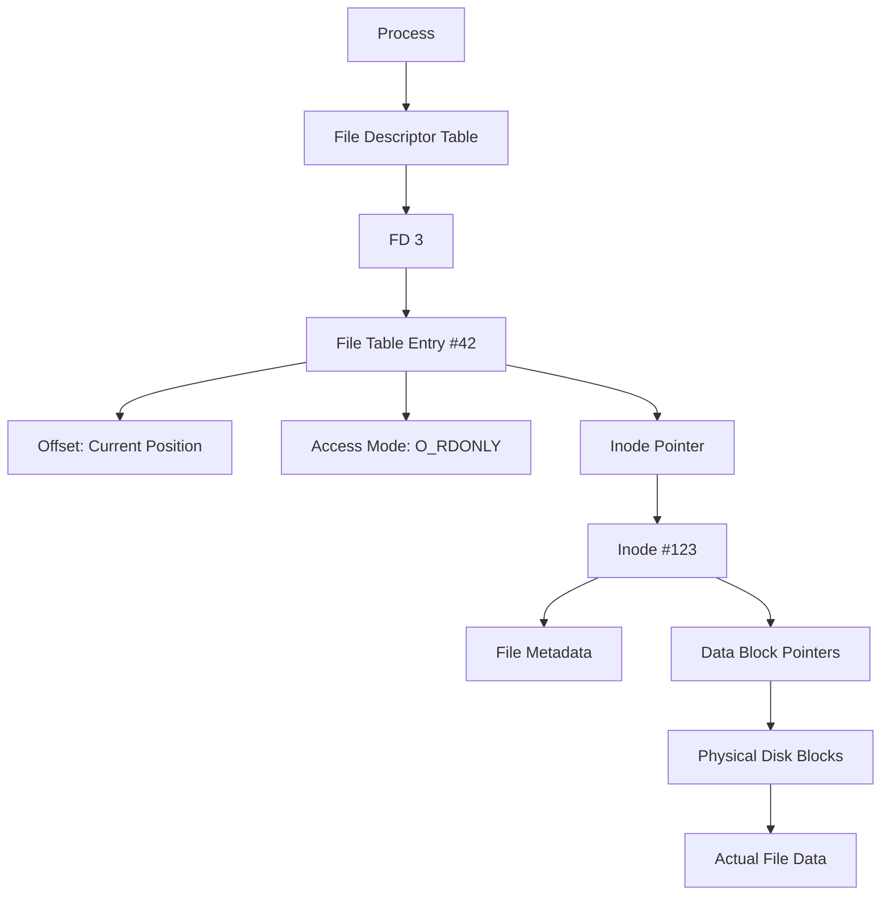

# Custom File System - PSFS

## Table of Contents
- [Virtual Address Space](#virtual-address-space)
- [File Descriptors and File System Architecture](#file-descriptors-and-file-system-architecture)
- [File Operations Flow](#file-operations-flow)
- [Directory Structure](#directory-structure)
- [Complete File Access Process](#complete-file-access-process)

---

## Virtual Address Space

### What is Virtual Address Space?

**Virtual address space** is the range of memory addresses given to a process by the operating system. These addresses are *virtual*, meaning they don't directly refer to physical RAM — they are managed by the system using actual RAM and sometimes disk (swap) in the background.

### Key Concepts

- **Range of addresses**: It's a range of addresses the process *thinks* it can use
- ❌ **Not in "virtual RAM"**: Virtual RAM isn't a thing technically
- ✅ **Part of virtual memory**: A system combining RAM + swap
- ✅ **OS and hardware mapping**: Handle the mapping from virtual addresses → real physical locations

### Benefits

✅ **Simplicity**: Every program thinks it's the only one running and can use all memory from `0x00000000` to `0xFFFFFFFF`.

---

## File Descriptors and File System Architecture

### What is a File Descriptor?

A **file descriptor (FD)** is a small **integer** (number) that a program uses to access a file or I/O resource. Each process gets its own file descriptor table where files they want to access are assigned numbers.

#### Key Points:
- First 3 file descriptors are reserved (0: stdin, 1: stdout, 2: stderr)
- Process-specific: Different processes can have overlapping file descriptors
- Example: If a process opens `/home/user/data.txt`, it might get file descriptor 3

### File System Architecture Overview

```
Process FD Table → File Table → Inode Table → Disk Blocks
```

#### 1. File Descriptor Table (Process-specific)
- Maps FD numbers to file table entries
- Each process has its own table

#### 2. File Table (System-wide)
The file table is a system-wide kernel structure that keeps track of various open files in the system.

**Contains:**
- **File offset**: Current position in the file for next read/write
- **Access mode**: Whether file is opened for reading, writing, or both
- **Reference count**: How many file descriptors point to this entry
- **Pointer to inode**: Reference to the file's inode in the inode table

**Important Notes:**
- If the same process or another process opens the file separately, they get **separate file table entries**
- If a file descriptor is duplicated or inherited (e.g., with `dup()` or `fork()`), they **share the same entry**

#### 3. Inode Table
Contains inodes of different files with important metadata.

**Inode Contents:**
- File type (regular file, directory, symbolic link, etc.)
- File size
- Permissions (read, write, execute for owner, group, others)
- Ownership (user ID and group ID)
- Timestamps (creation, modification, access times)
- **Data block pointers**: Locations on disk where the file's actual data is stored

---

## File Operations Flow

### How File Reading Works

```mermaid
graph TD;
    A[read() system call with FD] --> B[Lookup FD in process FD table];
    B --> C[Get file table entry];
    C --> D[Get current offset and inode pointer];
    D --> E[Lookup inode table for metadata];
    E --> F[Calculate physical disk block from offset];
    F --> G[Read data from disk block];
    G --> H[Update offset in file table];
```

### Understanding Offset vs Inode

#### ✅ **Offset**:
- Stored in the **file table** (in RAM)
- Tells **which byte** in the file to start read/write
- Automatically updated after read/write operations
- Can be changed manually using `lseek()`

#### ✅ **Inode**:
- Stored on **disk**
- Holds metadata (permissions, size, etc.)
- **Block pointers**: Maps logical block → physical disk block

#### ✅ **Logical vs Physical Block**:
- **Logical block**: Block number in the file (e.g., block 0 = bytes 0–4095)
- **Physical block**: Where data is physically stored on disk

### Example Flow:
1. You read from offset 6000
2. OS calculates: 6000 / 4096 = block 1, remainder = 1904
3. Inode lookup: logical block 1 → physical disk block 501
4. OS reads physical disk block 501 starting at byte 1904

---

## Directory Structure

**Directory** is basically a file that references the names of files to their respective inodes.

### Path Resolution Example
For `/home/user/data.txt`, the kernel:
1. Looks up the inode for `/` (root directory)
2. Finds the inode number for `home` in the root directory's data
3. Finds the inode number for `user` in the home directory's data
4. Finds the inode number for `data.txt` in the user directory's data

---

## Complete File Access Process

### Phase 1: Path Resolution
```mermaid
graph TD;
    A[open("/home/user/notes.txt", O_RDONLY)] --> B[Start at root inode #2];
    B --> C[Look in root directory for 'home'];
    C --> D[Find 'home' → inode #45];
    D --> E[Look in home directory for 'user'];
    E --> F[Find 'user' → inode #76];
    F --> G[Look in user directory for 'notes.txt'];
    G --> H[Find 'notes.txt' → inode #123];
```

**Step-by-step:**
1. Start at `/` → inode #2 (root)
2. Look inside inode #2's directory block → find `"home"` → inode #45
3. Look inside inode #45 → find `"user"` → inode #76
4. Look inside inode #76 → find `"notes.txt"` → inode #123 ✅

### Phase 2: Create File Table and FD

Once we found **inode #123**, the OS:

1. **Creates file table entry:**
   ```
   file_table[42]:
   → pointer to inode #123
   → offset = 0
   → flags = O_RDONLY
   ```

2. **Creates FD entry:**
   ```
   fd_table[3] = &file_table[42];
   ```

✅ **File is now open and ready for operations**

### Complete Architecture Diagram



### File Operation Summary

When you use `read(fd, ...)` or `write(fd, ...)`, the OS:
1. Uses `fd` to find entry in file table
2. Uses file table to find inode
3. Uses inode to locate actual disk blocks
4. Performs the operation and updates offset

---

## Key Takeaways

- **Virtual Address Space**: Gives each process the illusion of having all memory to itself
- **File Descriptors**: Process-specific integers that reference system-wide file table entries
- **File Table**: Tracks open files with current position and access information
- **Inodes**: Store file metadata and pointers to actual data on disk
- **Directories**: Special files that map names to inode numbers
- **Path Resolution**: Multi-step process to find files by traversing directory structure

This architecture provides efficient, secure, and organized file access while maintaining process isolation and data integrity.


## References for Code
- [fnctl.h - fcntl.h - file control options](https://pubs.opengroup.org/onlinepubs/007904875/basedefs/fcntl.h.html)
- [fcntl - file control
](https://pubs.opengroup.org/onlinepubs/007904875/functions/fcntl.html)